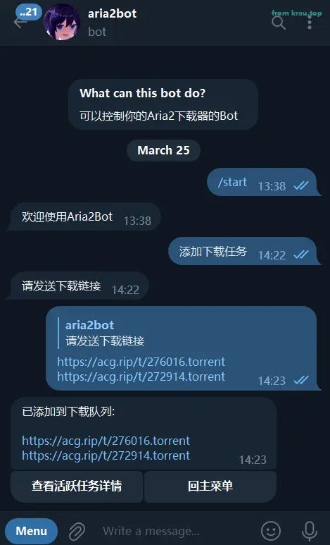
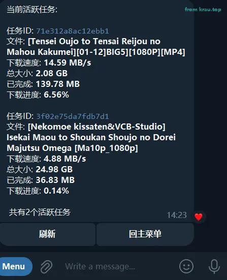
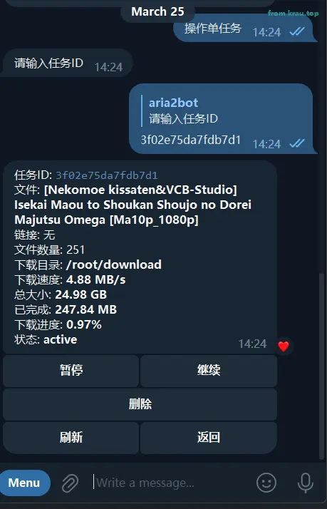

<div align="center">
  
# Aria2bot

使用 Telegram bot 控制 Aria2 下载器。

Control Aria2 downloader using Telegram bot.

 

</div>

## ⭐ 特性

⚡ 异步实现

📝 交互式添加下载任务，支持多链接

📊 查询下载器状态

✨ 内联键盘刷新

😋 中文编程(伪)

## 🖥 使用

### docker-compose 部署

下载 `docker-compose.yml` 文件:

```yml
version: "3"
services:
  aria2bot:
    image: ghcr.io/krau/aria2bot:main
    container_name: aria2bot
    restart: unless-stopped
    volumes:
      - /path/to/config.yaml:/aria2bot/config.yaml #冒号前是你自己的配置文件路径
      - /path/to/log:/aria2bot/log #冒号前是你自己的日志文件路径
    environment:
      - TZ=Asia/Shanghai
    network_mode: host
```

在同一目录下新建并修改 `config.yaml` 中的各项配置

```yaml
# 必填
机器人密钥: ""
# 主人id，必填，支持多个
主人:
  -

# 代理地址，留空为不使用代理
代理地址:

# 日志等级，可选: DEBUG INFO WARN ERROR 还有什么我忘了,建议保持默认
控制台日志等级: "INFO"
文件日志等级: "DEBUG"

# 支持多下载器(正在开发中,暂时只支持第一个)
# 下载器名: 自定义，将作为标识
# 下载器地址: 示例: http://127.0.0.1:6800/jsonrpc
# 下载器密钥: 即你设置的rpc密钥
下载器组:
  - 下载器名: ""
    下载器地址: ""
    下载器密钥: ""
  - 下载器名: ""
    下载器地址: ""
    下载器密钥: ""
```

运行 `docker-compose up -d` 启动容器

### ⚙️ 源码运行

Python 版本: 3.10+

```bash
git clone https://github.com/krau/aria2bot
cd aria2bot
```

用你喜欢的工具创建并激活虚拟环境后安装依赖

```bash
pip install -r requirements.txt
```

修改 `config.yaml` 各项配置，然后运行 'bot.py' 即可：

```bash
python bot.py
```

## 🗄 Demo

  

  

  

  

## 📅 TODO

| 🔔 未完成 | ✅ 已完成 |
| -------- | -------- |
|  多下载器支持      |  添加下载任务        |
|  查询各项状态       |   交互式添加下载任务，支持多链接       |
|   对每个任务进行查看与操作(内联键盘)      | 下载器状态         |
|   任务完成通知      | 任务队列         |
|         | 对每个任务进行查看与操作         |
|         | docker compose 部署         |


## 🔨 参与开发

欢迎提交 PR, 请使用 black 格式化代码

~~风格上希望保持伪中文编程~~

###  配置

本项目使用了 [Dynaconf](https://github.com/dynaconf/dynaconf) 作为配置管理，开发时请在项目根目录下创建 `config.dev.yaml` 文件，它会覆盖 `config.yaml` 中的配置。

## ♥ 鸣谢

- [aioaria2](https://github.com/synodriver/aioaria2)
- [python-telegram-bot](https://github.com/python-telegram-bot/python-telegram-bot)

etc.

## 📖 License

MIT
