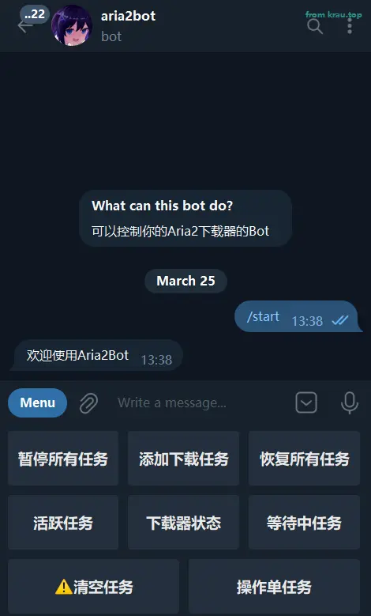

# aria2bot

Aria2 Telegram Bot 用 bot 控制 Aria2 下载器

## 特性

⚡ 全程异步实现+类型标注

📝 交互式添加下载任务,支持多链接

📊 查询下载器状态

✨ 内联键盘刷新

😋 中文编程(伪)

## 使用

### docker-compose 部署

下载 `docker-compose.yml` 文件:

```yml
version: "3"
services:
  aria2bot:
    image: ghcr.io/krau/aria2bot:main
    container_name: aria2bot
    restart: unless-stopped
    volumes:
      - /path/to/config.yaml:/aria2bot/config.yaml #冒号前是你自己的配置文件路径
      - /path/to/log:/aria2bot/log #冒号前是你自己的日志文件路径
    environment:
      - TZ=Asia/Shanghai
    network_mode: host
```

在同一目录下新建并修改 `config.yaml` 中的各项配置

```yaml
# 必填
机器人密钥: ""
# 主人id,必填,支持多个
主人:
  -

# 代理地址,留空为不使用代理
代理地址:

# 日志等级,可选: DEBUG INFO WARN ERROR 还有什么我忘了,建议保持默认
控制台日志等级: "INFO"
文件日志等级: "DEBUG"

# 支持多下载器(正在开发中,暂时只支持第一个)
# 下载器名: 自定义,将作为标识
# 下载器地址: 示例: http://127.0.0.1:6800/jsonrpc
# 下载器密钥: 即你设置的rpc密钥
下载器组:
  - 下载器名: ""
    下载器地址: ""
    下载器密钥: ""
  - 下载器名: ""
    下载器地址: ""
    下载器密钥: ""
```

运行 `docker-compose up -d` 启动容器

### 源码运行

Python 版本: 3.10+

```bash
git clone https://github.com/krau/aria2bot
cd aria2bot
```

用你喜欢的工具创建并激活虚拟环境,然后

```bash
pip install -r requirements.txt
```

修改 `config.yaml` 各项配置,然后

```bash
python bot.py
```

## demo

  

  

  

  

## TODO

- [ ] 多下载器支持
- [x] 添加下载任务
  - [x] 交互式添加下载任务,支持多链接
- [ ] 查询各项状态
  - [x] 下载器状态
  - [x] 任务队列
  - [x] 对每个任务进行查看与操作
  - [ ] 对每个任务进行查看与操作(内联键盘)
- [ ] 任务完成通知
- [x] docker compose 部署

## 参与开发

欢迎提交 PR, 请使用 black 格式化代码

~~风格上希望保持伪中文编程~~

### 配置

本项目使用了 [Dynaconf](https://github.com/dynaconf/dynaconf) 作为配置管理,开发时,请在项目根目录下创建 `config.dev.yaml` 文件,它会覆盖 `config.yaml` 中的配置.

## 鸣谢

- [aioaria2](https://github.com/synodriver/aioaria2)
- [python-telegram-bot](https://github.com/python-telegram-bot/python-telegram-bot)

etc.

## License

MIT
